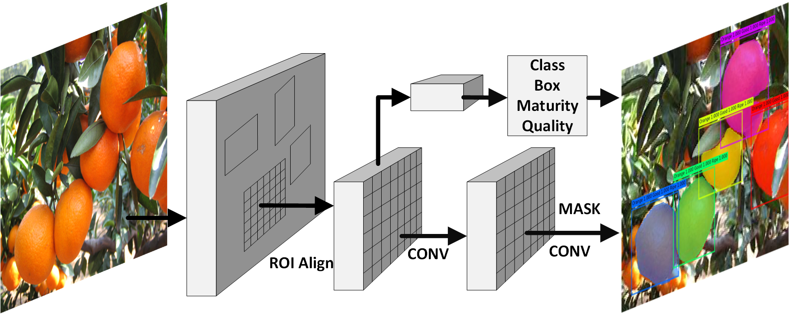
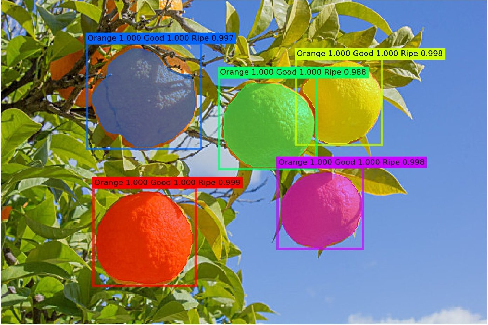
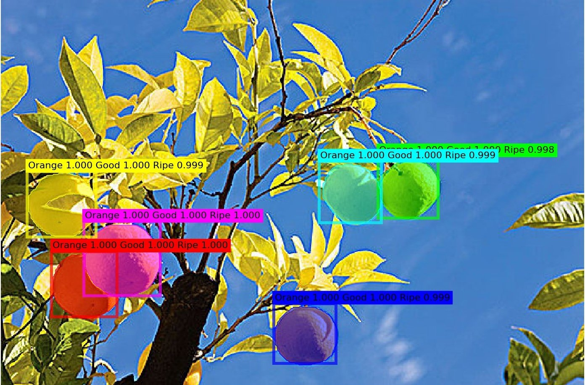
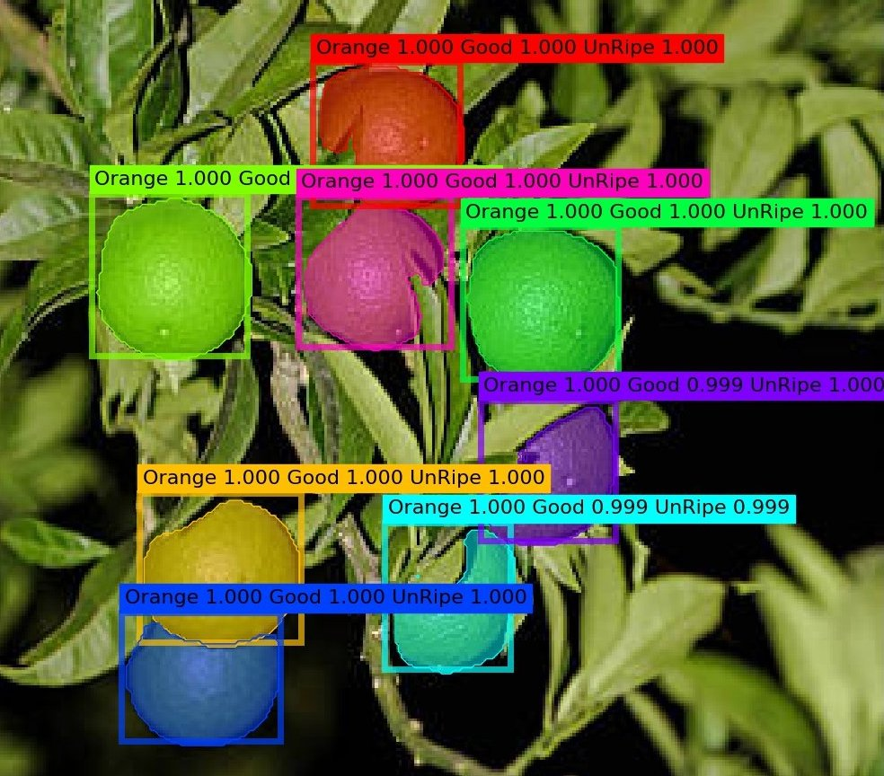
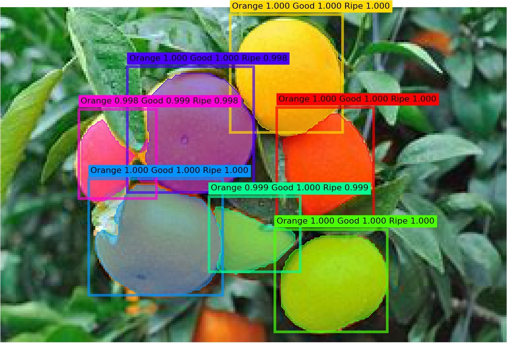
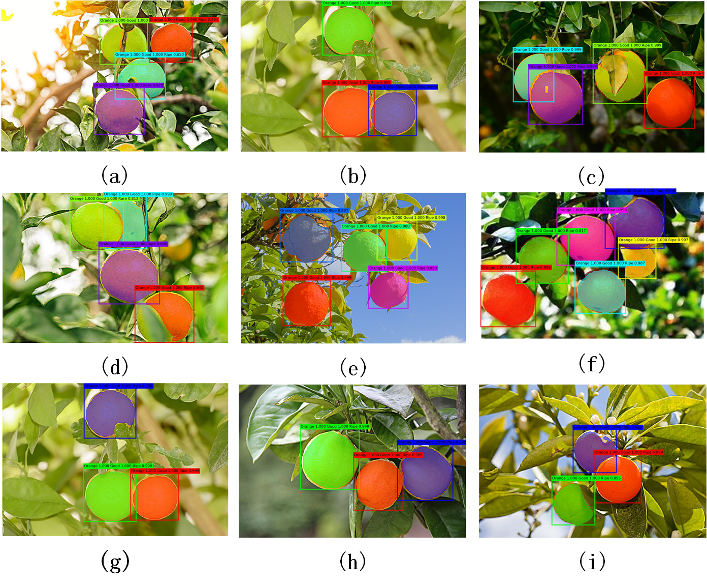

Multi-scene citrus detection based on multi-task deep learning network
-----------------



Several examples of multi task citrus detection on test data set:









Install
-----------------

  Check [INSTALL.md](INSTALL.md) for installation instructions.


Prepare Data
----------------
```bash
  mkdir -p data/train
  mkdir -p data/val
  mkdir -p data/test
  ln -s /path_to_coco_dataset/annotations
  ln -s /path_to_coco_dataset/train
  ln -s /path_to_coco_data/val
  ln -s /path_to_coco_data/test
```


Model weights
---------------
```bash
  mkdir weights
  #The pretrained models will be downloaded when running the program.
```
My training log and pre-trained models can be found here [link](https://github.com/matterport/Mask_RCNN/releases) or [link](https://pan.baidu.com/s/1IAjp7_ZP3-3jLpThf7WLbQ)(pw:arn3).

Evaluation
---------------

To evalute the model, put the corresponding weights file in the `./weights` directory and run one of the following commands. 

```bash
# The model will detect the images in data/test/images, and output the detection results to data/test/result
python Multitask-Test.py
```

Training
---------------

To train the model, put the corresponding weights file in the `./weights` directory and run one of the following commands. 

```bash
# Put the pre training model with coco into logs and the model will be trained from data/train
python Multitask-Train.py
```


Results
------------




License
---------------
This code is released under the MIT license. See [LICENSE](LICENSE) for additional details.

Thanks to the Third Party Libs
---------------  
[Mask_RCNN](https://github.com/matterport/Mask_RCNN)   
[Tensorflow](https://github.com/tensorflow/tensorflow)   